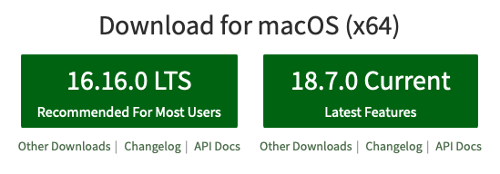

<h1 align="center">
Web Development Course 3340
</h1>

<h4 align="center">
University of Windsor
</h4>


<hr>

<h3 align="center">
🔴 We are still working on this project 🔴
</h3> 

<hr>

The project is the part of the university courseware 3340 which relates to basics of the web development. As the part of course, we learn HTML, CSS, javascript, Server Side PHP, NodeJs, Databases, etc. 

Click on the link to check the [Requirements](https://github.com/arun-esh/comp3340Project/blob/main/requirements.md)


## About Travelx

      

Named out Project as **TRAVELX** which is vacation booking website and has locations all over the world. Travelx customer can book their stay as per their likings. 


### How it started

To have database was one of the requirements of the project. Started googling around and decided to go with mongoDB. While learning mongoDB, [Arunesh](https://github.com/arun-esh) came across the open databases from [mongoDB university](https://university.mongodb.com). Here is his [Proof of Completion](https://university.mongodb.com/course_completion/836e6c4a-4f7d-43ed-8ed0-24f0319d261b). 

Dataset `sample_airbnb` has vocation home listings and their reviews. This dataset has around 5000 entries and each entry has minimum of 30 fields. We needed a dataset which has decent content and also can easily be combined with frontend. 

**Initial Idea**

* Get a front page with all the locations
  * Add some basic info related to locations
    * location name
    * price
    * summary or description
    * number of bathrooms
    * number of bedrooms
    * image of the location
    * link to detailed information about the location
* Get few static pages
  * Login Page
  * Signup Page
  * About
  * Contact us


### Tech we used

      

   


## How to install

### For mac users

* Go to [Nodejs.org](https://nodejs.org/en/)
* Download the package



* Run the installer


Verify Node installtion

```bash
node -v
```

